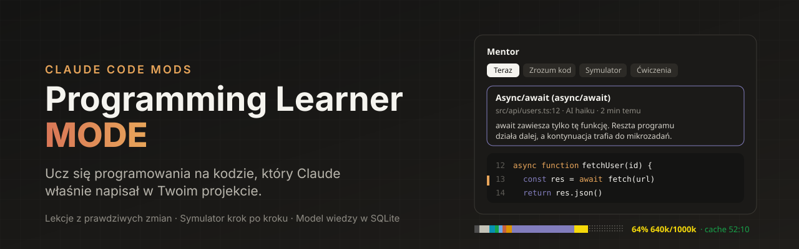
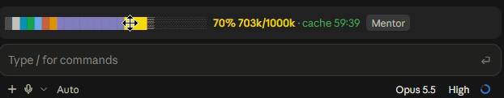
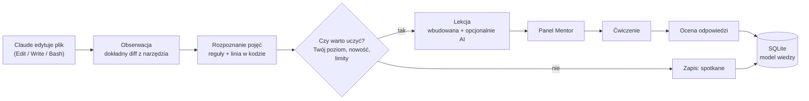
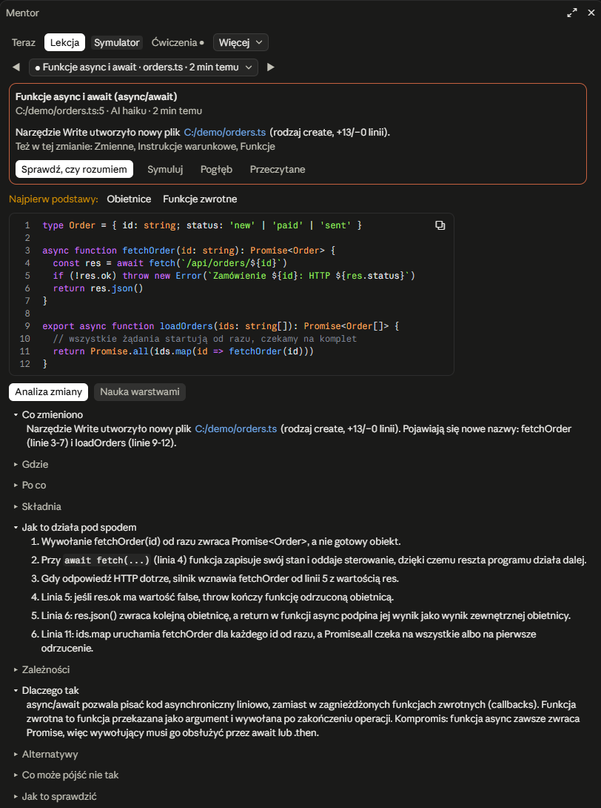
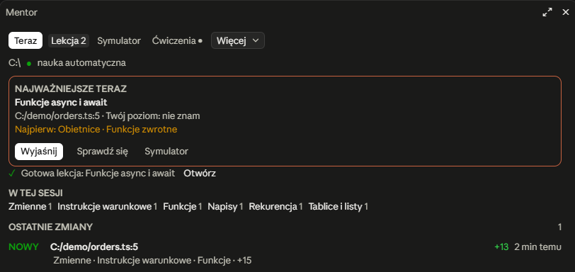
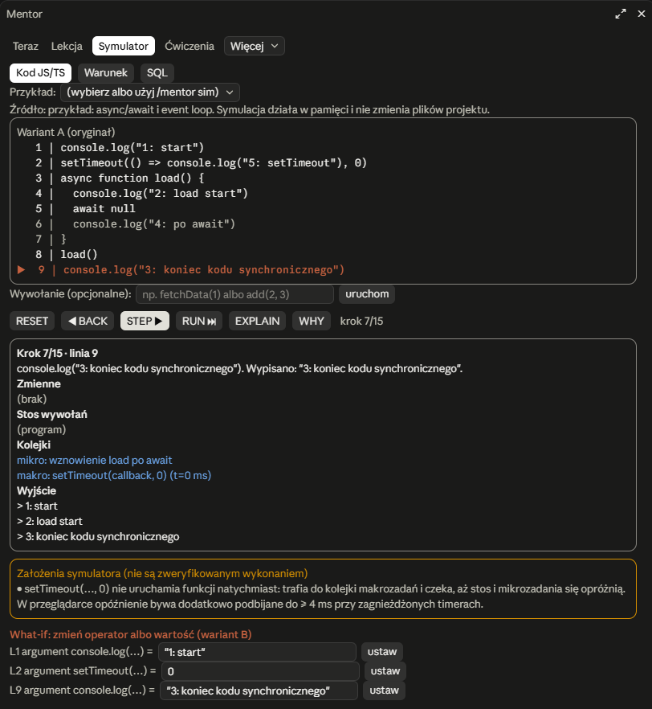

<p align="center">
  
</p>

<p align="center">
  <a href="#instalacja"></a>
  <a href="#wymagania"></a>
  <a href="#wymagania"></a>
  <a href="#testy"></a>
  <a href="#prywatność"></a>
</p>

<p align="center">
  <b>Claude pisze kod. Ty rozumiesz, dlaczego on działa.</b><br>
  Dwa mody do Claude Code: osobisty nauczyciel programowania, który uczy na zmianach w Twoim projekcie,<br>
  i pasek kontekstu, który pokazuje, ile tokenów zostało i kiedy wygaśnie cache.
</p>

---

## Spis treści

- [Po co to jest](#po-co-to-jest)
- [Co dostajesz](#co-dostajesz)
- [Jak to działa](#jak-to-działa)
- [Instalacja](#instalacja)
- [Pierwsze kroki](#pierwsze-kroki)
- [Claude Code Mentor](#claude-code-mentor)
- [Context Bar](#context-bar)
- [Prywatność](#prywatność)
- [Koszty](#koszty)
- [Dane i kopie zapasowe](#dane-i-kopie-zapasowe)
- [Architektura](#architektura)
- [Testy](#testy)
- [FAQ](#faq)
- [In English](#in-english)

---

## Po co to jest

Claude Code potrafi w kilka minut zbudować działającą funkcję, endpoint albo całą aplikację. Efekt działa, ale często nie wiesz **dlaczego**: co robi `await`, czemu warunek ma `<=` a nie `<`, po co ten `LEFT JOIN`, co się stanie, gdy obietnica zostanie odrzucona.

**Programming Learner MODE** zamienia każdą sesję z Claude w lekcję. Mentor obserwuje, co Claude faktycznie zmienia w Twoich plikach, wyłapuje mechanizmy programistyczne w tym kodzie i tłumaczy je od intuicji aż po to, co dzieje się pod spodem. Potem sprawdza, czy rozumiesz, i pamięta Twoje postępy przez miesiące.

Wszystko dzieje się w osobnym panelu obok rozmowy. Normalna praca z Claude zostaje nietknięta.

## Co dostajesz

<table>
  <tr>
    <td width="50%" valign="top">
      <h3>🎓 Claude Code Mentor</h3>
      <ul>
        <li><b>Lekcje z prawdziwych zmian</b>: kod z Twojego projektu, plik i numer linii, mechanizm, powód, alternatywy, typowe błędy.</li>
        <li><b>Symulator wykonania</b>: STEP, BACK, RUN, zmienne, stos wywołań, kolejki event loop, podmiana operatorów <code>&lt;</code> → <code>&lt;=</code> i porównanie wariantów.</li>
        <li><b>Ćwiczenia</b>: pytania o Twój kod, wykrywanie błędnych przekonań, zadanie utrwalające.</li>
        <li><b>Model wiedzy</b>: 79 pojęć w grafie zależności, 5 poziomów, powtórki rozłożone w czasie, wszystko w lokalnym SQLite.</li>
      </ul>
    </td>
    <td width="50%" valign="top">
      <h3>📊 Context Bar</h3>
      <ul>
        <li><b>Pasek okna kontekstu</b> nad polem promptu, podzielony na kategorie: system, narzędzia, MCP, skille, wiadomości.</li>
        <li><b>Dymki po najechaniu</b>: nazwa kategorii, tokeny i procent.</li>
        <li><b>Licznik cache promptu</b>: ile zostało do wygaśnięcia, żeby następna wiadomość nie płaciła za cały kontekst od nowa.</li>
        <li><b>Strefy ostrzegawcze</b> od 60% i 80% oraz przycisk <b>Mentor</b>.</li>
      </ul>
    </td>
  </tr>
</table>

<p align="center">
  
</p>

## Jak to działa



1. **Obserwacja bez ingerencji.** Hooki odczytują wynik narzędzi Claude i niczego nie zmieniają. Zmiana jest brana z dokładnego diffu konkretnej edycji, a nie z `git diff`, więc Mentor nie przypisze Claude Twoich wcześniejszych zmian ani pracy innej sesji.
2. **Rozpoznanie pojęć.** Jawne reguły dla JS, TS, Python, PHP i SQL wskazują, które mechanizmy pojawiły się w kodzie i w której linii.
3. **Priorytet.** Liczy się to, czego jeszcze nie umiesz. Pojęcie opanowane nie dostaje lekcji, chyba że czas na powtórkę.
4. **Lekcja.** Zawsze powstaje wersja wbudowana, bez kosztów. Gdy pozwala budżet, model AI dopasowuje ją do Twojego kodu i poziomu.
5. **Dowód zrozumienia.** Poziom rośnie tylko po ocenionych odpowiedziach. To, że Claude użył czegoś w projekcie, liczy się jako „spotkane”, nigdy jako wiedza.

## Instalacja

### Wymagania

| | |
|---|---|
| System | Windows 11 (pozostałe systemy: patrz [FAQ](#faq)) |
| Claude Code | aplikacja Claude Desktop (zakładka Code) lub CLI, wersja z obsługą modów |
| Node.js | 22.5+ (zalecany 24 LTS), w nim wbudowany `node:sqlite` |

### Opcja A: jedno polecenie w Claude Code

W sesji Claude Code w terminalu:

```text
/plugin marketplace add NikodemJachec99/Programming-learner-MODE
/plugin install claude-code-mentor@programming-learner-mode
/plugin install context-bar@programming-learner-mode
```

Wybierz zakres **user**, żeby mody działały w każdym projekcie.

### Opcja B: skrypt instalacyjny (zalecany)

Robi to samo co opcja A, a dodatkowo zakłada bazę, wykrywa poprawną ścieżkę do Node (także przy nvm) i sprawdza całość:

```powershell
git clone https://github.com/NikodemJachec99/Programming-learner-MODE.git
cd Programming-learner-MODE
pwsh -File scripts\install.ps1
```

| Flaga | Co robi |
|---|---|
| `-FromGitHub` | rejestruje marketplace z GitHuba zamiast lokalnego klonu |
| `-SkipContextBar` | instaluje tylko Mentora |

Skrypt można uruchamiać wielokrotnie: aktualizuje instalację i nie rusza danych nauki.

### Aktualizacja i odinstalowanie

```powershell
git pull; pwsh -File scripts\install.ps1      # aktualizacja
pwsh -File scripts\uninstall.ps1              # odinstalowanie, dane zostają
pwsh -File scripts\uninstall.ps1 -DeleteData  # z usunięciem danych (najpierw eksport na Pulpit)
pwsh -File scripts\diagnose.ps1               # diagnostyka, niczego nie zmienia
```

## Pierwsze kroki

1. Otwórz nową sesję w zakładce **Code** w Claude Desktop, w dowolnym projekcie.
2. Panel **Mentor** otworzy się z boku sam, bez zabierania fokusu klawiatury.
3. Pracuj normalnie. Po pierwszej istotnej zmianie w kodzie zobaczysz w zakładce **Teraz**, co się stało i co warto zrozumieć.
4. Kliknij **Sprawdź, czy rozumiem**, gdy chcesz się przetestować.

| Polecenie | Działanie |
|---|---|
| `/mentor` | otwiera panel |
| `/mentor explain` | pogłębiona lekcja o ostatniej istotnej zmianie |
| `/mentor quiz` | ćwiczenie do bieżącego tematu |
| `/mentor sim` | symulator dla zaznaczonego tekstu |
| `/mentor sim plik.ts:10-30` | symulator dla fragmentu pliku |
| `/mentor recap` / `progress` | podsumowanie i postępy |
| `/mentor path` | ścieżka nauki i graf pojęć |
| `/mentor pause` / `resume` | wstrzymanie i wznowienie automatycznych lekcji |
| `/mentor settings` / `diag` | ustawienia, dane, diagnostyka |
| `/context-bar` | włącza i wyłącza pasek |
| `/context-bar ttl 5` | czas życia cache: 5 albo 60 minut |

## Claude Code Mentor

<table>
  <tr>
    <td width="50%" valign="top" align="center">
      <br>
      <sub><b>Lekcja</b>: kod z projektu z numerami linii, mechanizm krok po kroku, sekcje do rozwinięcia</sub>
    </td>
    <td width="50%" valign="top" align="center">
      <br>
      <sub><b>Teraz</b>: najważniejsza rzecz do zrozumienia, brakujące podstawy, ostatnie zmiany Claude</sub>
      <br><br>
      <br>
      <sub><b>Symulator</b>: async/await krok po kroku, kolejki mikro i makro, wyjście</sub>
    </td>
  </tr>
</table>

### Siedem widoków

Główne zakładki to **Teraz**, **Lekcja**, **Symulator** i **Ćwiczenia**. Pozostałe są w menu **Więcej**.

| Zakładka | Co zawiera |
|---|---|
| **Teraz** | projekt, ostatnie operacje Claude (plik, linia, +/−), wykryte mechanizmy, najważniejsza rzecz do zrozumienia, brakujące podstawy, powtórki |
| **Lekcja** | lekcja o konkretnej zmianie w dwóch widokach: *Analiza zmiany* (co, gdzie, po co, składnia, mechanizm, zależności, dlaczego, alternatywy, błędy, weryfikacja) albo *Nauka warstwami* (intuicja, kod, mechanizm, dlaczego, praktyka, sprawdzenie) |
| **Symulator** | wykonanie krok po kroku, eksplorator warunków dla JS, Pythona i PHP, piaskownica SQL |
| **Ćwiczenia** | pytania o Twój kod, ocena, wykryte nieporozumienia, przykład z innej strony, zadanie utrwalające |
| **Moja wiedza** | pojęcia na 5 poziomach, opanowanie, pewność oceny, historia, błędne przekonania |
| **Ścieżka** | następne kroki z uzasadnieniem, graf zależności pojęć, mapa kompetencji |
| **Ustawienia** | nauka, częstotliwość, szczegółowość, koszty, model, prywatność, eksport i import, diagnostyka |

### Lekcja rozdziela fakt od domysłu

Każda lekcja jasno oznacza:

- **zaobserwowaną zmianę**, czyli fakt z diffu,
- **hipotezę**, czyli prawdopodobny cel wywnioskowany z kodu,
- **cel potwierdzony**, tylko gdy wynika z Twojego polecenia albo odpowiedzi Claude,
- **niepewność i uproszczenia**, razem z dokładniejszym modelem tam, gdzie lekcja upraszcza.

### Symulator wykonania

Deterministyczny interpreter podzbioru JavaScript i TypeScript, napisany od zera. Nie uruchamia Twojego kodu w prawdziwym środowisku i nigdy nie zmienia plików projektu.

| Funkcja | Opis |
|---|---|
| `STEP` `BACK` `RESET` `RUN` | przejście po krokach w obie strony |
| `EXPLAIN` / `WHY` | co robi bieżący krok i dlaczego wykonuje się właśnie teraz |
| Zmienne i stos | wartości przed i po, zmienione zmienne podświetlone, ramki wywołań z argumentami |
| Event loop | kolejka mikrozadań i makrozadań, `await`, `Promise`, `setTimeout` w kolejności zgodnej ze specyfikacją |
| What-if | zamiana operatora albo wartości tworzy wariant B, `COMPARE` opisuje różnicę prostym językiem |
| Warunki | `x < 10` kontra `x <= 10` dla przypadków brzegowych, z semantyką JS, Pythona 3 i PHP 8 |
| SQL | prawdziwy SQLite w pamięci: FROM i JOIN, WHERE z wartością UNKNOWN dla NULL, GROUP BY, wynik |

Rzeczy niedeterministyczne, takie jak `fetch`, `Math.random` czy `Date.now`, są wyraźnie oznaczone jako założenia, a nie zweryfikowane wykonanie.

### Model wiedzy

| Poziom | Warunek |
|---|---|
| **Opanowane** | opanowanie ≥ 85%, co najmniej 3 dobre odpowiedzi w co najmniej 2 różne dni, w tym zadanie z przewidywania, diagnozy albo wyjaśnienia |
| **Potrafię zastosować** | opanowanie ≥ 65%, co najmniej 2 dobre odpowiedzi, w tym jedna z zadania wymagającego myślenia |
| **Rozumiem częściowo** | opanowanie ≥ 35% i co najmniej 1 dobra odpowiedź |
| **Uczę się** | lekcja, ćwiczenie albo eksperyment w symulatorze |
| **Nie znam** | brak dowodów |

- 79 pojęć od zmiennych po RAG i agentów AI, połączonych grafem zależności, na przykład *funkcje → callbacki → Promise → async/await → event loop*.
- Brakujące podstawy są proponowane jako krótkie lekcje uzupełniające, bez cofania do absolutnego początku.
- Konkretne błędne przekonania (np. mylenie `=` z `===` albo off-by-one przy `<` i `<=`) są zapisywane i przećwiczane, aż znikną.
- Powtórki rozłożone w czasie w stylu SM-2.

## Context Bar

- Jedna linia nad promptem: kolorowy pasek, procent zajętości, licznik cache, przycisk **Mentor**.
- Na Claude Desktop pasek jest rysowany w SVG z dymkami. W terminalu jest wersją tekstową.
- Licznik cache liczy od końca ostatniej odpowiedzi: zielony powyżej 5 minut, żółty poniżej, czerwony po wygaśnięciu. W trakcie odpowiedzi pokazuje `cache: odświeżany`.
- Dane o kontekście pochodzą z lokalnego oszacowania `/context`, więc pasek nie kosztuje żadnego wywołania API.

## Prywatność

- **Dane tylko lokalnie.** Brak telemetrii, brak synchronizacji, brak zewnętrznych serwerów.
- **Pliki wrażliwe są pomijane:** `.env*`, klucze, certyfikaty, `credentials`, `secrets`, `.npmrc`, `.ssh`, `wp-config.php`.
- **Sekrety są wycinane** przed zapisem i przed wysłaniem do AI: klucze API Anthropic, OpenAI, Stripe, Google i AWS, tokeny GitHub i Slack, JWT, hasła w adresach URL i przypisaniach, klucze prywatne.
- Ustawienie **„nie wysyłaj kodu”** całkowicie wyłącza przekazywanie kodu do lekcji AI.
- Lekcje AI idą tym samym kanałem i kontem co sam Claude Code. Nie startują tury w rozmowie i niczego nie zmieniają w plikach.

## Koszty

Lekcje wbudowane są darmowe. Lekcje AI to dodatkowe wywołania modelu z Twojego konta, więc są ściśle limitowane:

| Profil | Automatyczne lekcje AI dziennie | Limit tokenów dziennie |
|---|---|---|
| Wyłączone | 0 | 0 |
| Oszczędny | 8 | 40 000 |
| **Zrównoważony** (domyślny) | 25 | 150 000 |
| Hojny | 60 | 400 000 |

Dodatkowo działają:

- minimalny odstęp między lekcjami,
- cache identycznych zmian,
- bezpiecznik, który po 3 błędach API robi 15 minut przerwy,
- osobny limit próśb ręcznych.

Limity są pilnowane atomowo w bazie, więc kilka równoległych sesji ich nie przekroczy.

## Dane i kopie zapasowe

| Co | Gdzie |
|---|---|
| Baza nauki | `%LOCALAPPDATA%\ClaudeCodeMentor\mentor.db` (SQLite, WAL) |
| Kopie zapasowe | `…\backups\`: codziennie 10 ostatnich, osobne przed migracją, importem i usunięciem |
| Eksporty JSON | `…\exports\` |
| Ścieżka do Node | `…\runtime.json` |

- Baza nie jest przypisana do konta Anthropic, więc przelogowanie się na inne konto niczego nie kasuje.
- Eksport, import (scalenie albo zastąpienie), kopię i trwałe usunięcie danych znajdziesz w zakładce **Ustawienia**.

## Architektura

```
plugins/
  claude-code-mentor/
    hooks/register.tsx      integracja: session.start, prompt.submit, tool.call, turn.complete, /mentor, panel
    hooks/mentor.ts         kontroler: obserwacje, priorytety, kolejka lekcji, ćwiczenia, zapis
    hooks/engine/           pojęcia, diff, ochrona sekretów, lekcje, ćwiczenia, koszty, graf
    hooks/sim/              lexer, parser, interpreter z event loop, semantyka wartości, warianty
    hooks/ui/               panel (7 zakładek) i pasek nad promptem
    hooks/content/          biblioteka 79 pojęć z grafem, błędnymi przekonaniami i pytaniami
    helper/mentor-db.mjs    SQLite: migracje, WAL, transakcje, model opanowania, powtórki
    helper/sql-sandbox.mjs  piaskownica SQL w pamięci
  context-bar/
    hooks/register.tsx      pasek kontekstu, SVG z dymkami, licznik cache
scripts/                    install, uninstall, diagnose
```

Najważniejsze decyzje:

- **Moduł modów nie ma Node**, więc baza działa jako krótki proces `node mentor-db.mjs` na każdą paczkę operacji (około 110 ms). Nie ma demona, portu ani tła do pilnowania. Równoległe sesje synchronizuje SQLite przez WAL, `BEGIN IMMEDIATE` i `busy_timeout`.
- **Zmiany z wyników narzędzi, nie z gita.** Gdy Claude edytuje plik, narzędzie zwraca dokładny diff tej edycji (`structuredPatch`). Pliki zmienione przed sesją są oznaczane, a nieudane i odrzucone operacje zapisywane jako nieudane.
- **AI jest opcjonalne.** Bez modelu dalej działają lekcje wbudowane, symulator, quizy deterministyczne, historia i postępy.

## Testy

| Zestaw | Wynik |
|---|---|
| `claude plugin test plugins/claude-code-mentor`: symulator, silnik, prywatność, UI na Desktop i w terminalu, przezroczystość hooków | 29 / 29 |
| `node --test` helpera bazy: migracje, model opanowania, 8 procesów równolegle, eksport i import, idempotencja | 15 / 15 |
| `node --test` piaskownicy SQL: NULL jako UNKNOWN, LEFT JOIN, COUNT(kolumna), blokada ATTACH | 5 / 5 |
| `claude plugin validate`: marketplace i oba pluginy | ✔ |

```powershell
claude plugin test plugins\claude-code-mentor
node --no-warnings --test "plugins/claude-code-mentor/helper/test/*.test.mjs"
```

Test ręczny zmiany konta Claude i restartu aplikacji jest opisany w [docs/TESTING.md](docs/TESTING.md).

## FAQ

<details>
<summary><b>Czy Mentor spowalnia Claude albo zmienia jego odpowiedzi?</b></summary>

Nie. Hooki przepuszczają każde zdarzenie bez zmian, a analiza działa w tle po zakończeniu tury. Treści edukacyjne trafiają wyłącznie do panelu. Nic nie jest dopisywane do rozmowy ani do kontekstu modelu.
</details>

<details>
<summary><b>Czy działa bez internetu albo bez AI?</b></summary>

Tak. Obserwacja zmian, lekcje wbudowane, symulator, eksplorator warunków, piaskownica SQL, quizy deterministyczne i cały model wiedzy działają lokalnie. AI tylko pogłębia lekcje i ocenia odpowiedzi otwarte.
</details>

<details>
<summary><b>Co z macOS i Linuksem?</b></summary>

Kod modów jest wieloplatformowy, ale skrypty instalacyjne i ścieżki danych są przygotowane pod Windows (`%LOCALAPPDATA%`). Na innych systemach zainstaluj pluginy przez `/plugin install` i ustaw zmienną `LOCALAPPDATA` na katalog danych.
</details>

<details>
<summary><b>Jakie języki rozumie?</b></summary>

Rozpoznawanie pojęć obejmuje JavaScript, TypeScript, Python, PHP, SQL i komendy powłoki. Symulator wykonuje podzbiór JS i TS. Eksplorator warunków obsługuje semantykę JS, Pythona 3 i PHP 8, a piaskownica SQL to prawdziwy SQLite.
</details>

<details>
<summary><b>Co dokładnie jest wysyłane do modelu?</b></summary>

Tylko przy lekcji AI: nazwa pojęcia, Twój poziom, fragment zmienionego kodu po wycięciu sekretów (do 80 linii, konfigurowalne), diff tej zmiany oraz Twoje polecenie z tej tury. Po wybraniu „nie wysyłaj kodu” idzie wyłącznie opis bez kodu.
</details>

## In English

**Programming Learner MODE** is a pair of Claude Code mods that turn every coding session into a lesson:

- **Claude Code Mentor**:
  - watches the exact edits Claude makes in your project and explains the mechanisms behind them in a side panel,
  - includes a step-by-step execution simulator with an event loop, call stack, operator what-ifs and variant comparison,
  - quizzes you on your own code,
  - tracks evidence-based mastery of 79 programming concepts in a local SQLite database, with spaced repetition.
- **Context Bar** shows the context window as a colored bar above the prompt, with per-category tooltips and a prompt-cache countdown.

The UI and lessons are in Polish. Everything stays on your machine.

## Licencja

© 2026 Nikodem Jachec. Wszelkie prawa zastrzeżone. Szczegóły w pliku [LICENSE](LICENSE).
